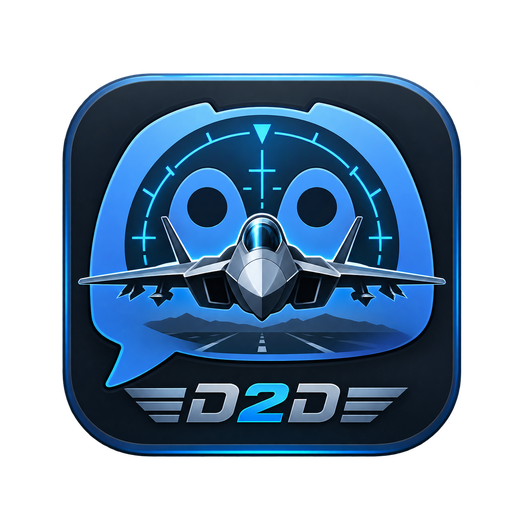

<div align="center">
  

# Discord2DCS

**Discord ↔ DCS – without Alt+Tab.**


[Deutsche Dokumentation](README.md)
</div>

> **Public Beta:** The core features and a complete fresh installation on a second/clean Windows PC have been tested successfully.

## Contents

- [What is Discord2DCS?](#what-is-discord2dcs)
- [What does a pilot need?](#what-does-a-pilot-need)
- [Pilot installation – step by step](#pilot-installation--step-by-step)
- [Using Discord2DCS in DCS](#using-discord2dcs-in-dcs)
- [DCS Options → Special](#dcs-options--special)
- [Update, repair, language and uninstall](#update-repair-language-and-uninstall)
- [Pilot troubleshooting](#pilot-troubleshooting)
- [For community admins](#for-community-admins)
- [Discord admin commands](#discord-admin-commands)
- [Security and stored data](#security-and-stored-data)
- [Known limitations](#known-limitations)

## What is Discord2DCS?

Discord2DCS links **one configured Discord text channel** to a dedicated DCS World in-game chat overlay.

```text
Discord text channel
       ↕
Discord2DCS bot on the community VPS
       ↕  encrypted WSS/TLS
Discord2DCS Windows client
       ↕  localhost only: 127.0.0.1:8765
DCS GameGUI overlay
```

Pilots can read Discord messages in DCS and reply to the configured channel without Alt+Tab. The gaming PC needs **no incoming port forwarding**.

## What does a pilot need?

Only:

- DCS World on Windows,
- internet access,
- the community's **server address**,
- a personal **pairing code** from an admin.

No Python, Lua, Docker or GitHub knowledge is required. The installer checks for Python 3.12 and can install Python 3.12.10 automatically from python.org after verifying the installer's digital signature.

## Pilot installation – step by step

1. Download the Community Client ZIP.
2. Right-click it and select **Extract All…**. Do not run the installer from inside the ZIP viewer.
3. Open the extracted folder and double-click `INSTALL.bat`.
4. Select `English` or `Deutsch`.
5. Enter the server address, normally `wss://dcs.example.com/ws`.
6. Enter the one-time personal pairing code supplied by your admin.
7. Choose whether Discord2DCS should start with Windows.
8. If DCS was open, close it completely and start it again.

The installer automatically detects existing `%USERPROFILE%\Saved Games\DCS*` profiles, installs the hook/overlay and Special Options tech mod, sets up Python, and installs Discord2DCS under:

```text
%LOCALAPPDATA%\Discord2DCS
```

## Using Discord2DCS in DCS

Toggle the overlay:

```text
Ctrl + Shift + D
```

To send a message, click the input field, type, then press `Enter` or click **Send**. **Clear** only clears the local overlay view; it does not delete Discord messages.

## DCS Options → Special

Open:

```text
DCS → Options → Special → Discord2DCS
```

Available settings:

- **Enable Discord2DCS** – master switch for the DCS module.
- **Show overlay on DCS start** – if disabled, the overlay starts hidden but `Ctrl + Shift + D` still works.
- **Show system messages in overlay** – controls internal `[System]` status messages only.
- **Language** – `Auto`, `Deutsch`, or `English`.

Restart DCS completely after changing these settings.

## Update, repair, language and uninstall

Installed tools live in `%LOCALAPPDATA%\Discord2DCS`.

- `UPDATE.bat` – install a newer extracted package while preserving the access token.
- `REPAIR.bat` – reinstall program files, Python environment, DCS hook and tech mod.
- `LANGUAGE.bat` – change the Windows-client/default overlay language.
- `AUTOSTART-AN.bat` / `AUTOSTART-AUS.bat` – enable/disable Windows autostart.
- `UNINSTALL.bat` – remove the local client, DCS files and shortcuts.

For a normal update no new pairing code is required.

## Pilot troubleshooting

Client log:

```text
%LOCALAPPDATA%\Discord2DCS\pc-client\Discord2DCS-Client.log
```

DCS log:

```text
%USERPROFILE%\Saved Games\DCS*\Logs\Discord2DCS.log
```

If a pairing code is invalid or expired, the admin must create a new code with `/dcs-client pairing`.

## For community admins

Normal pilots do **not** need their own VPS. A community runs one central server/bot. See [SERVER-ADMIN-GUIDE.md](SERVER-ADMIN-GUIDE.md).

## Discord admin commands

`/dcs-client create`, `list`, `info`, `panel`, `set-expiry`, `extend`, `revoke`, `enable`, `pairing`, `delete`, `pairings`, `cancel-pairing`, `adopt`, and `audit` are available to authorized admins.

Supported validity formats include preset days, custom values such as `45d`, `8w`, `12h`, fixed dates, and `Lifetime`.

## Security and stored data

- Production connections should use **WSS/TLS**.
- Secure Docker Compose binds port 8766 to `127.0.0.1` by default.
- Every user gets an individual access token.
- Pairing codes are one-time and time-limited.
- Access tokens and pairing codes are stored server-side as SHA-256 hashes rather than plaintext.
- SQLite stores client IDs, display names, Discord user IDs, status/expiry timestamps and admin audit entries.
- Never publish `.env`, the SQLite database, certificates, pairing codes or access tokens.

## Known limitations

- One configured Discord text channel is mirrored per server instance.
- User chat messages are not automatically translated.
- DCS Special Options are loaded by the hook at startup; restart DCS after changes.
- The Community Client targets Windows/DCS.
- The bundled automatic production TLS setup currently assumes a hostname/domain. `ws://IP:8766` is available for testing but is **not recommended for public production use**. A convenient secure no-domain setup remains a release item.

## License

Discord2DCS is released under the **MIT License**. Use, modification and redistribution are permitted under the terms in [LICENSE](LICENSE).
